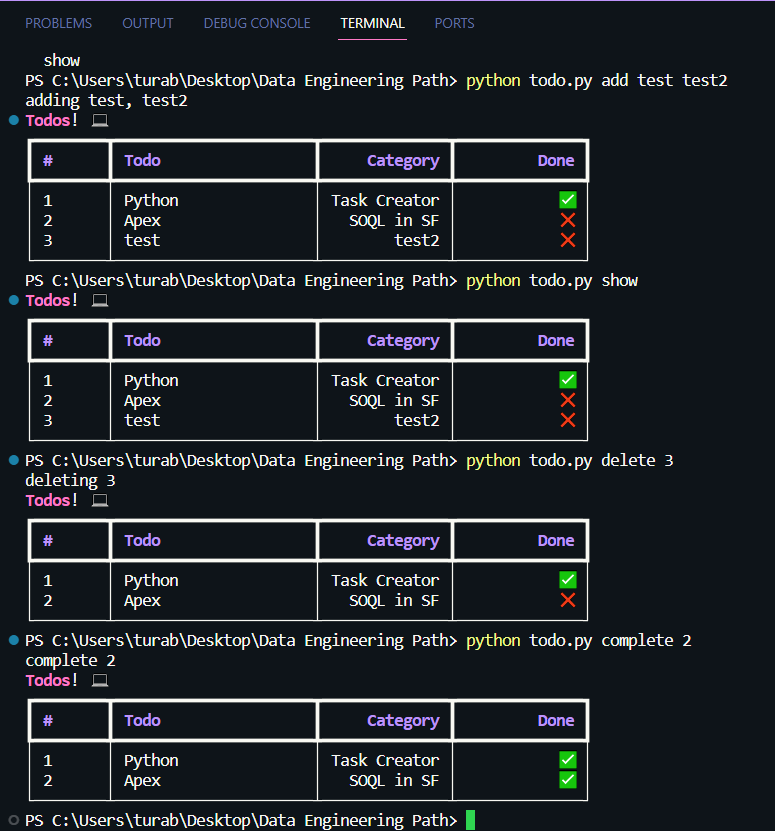

# TODO-Console-App


# Installation
```
pip install typer rich
```

# How to run?
To add new todo
```
python todo.py add todo_job todo_category
```

To display the list
```
python todo.py show
```

To complete the todo
```
python todo.py complete [todo number]
```

To delete the todo
```
python todo.py delete [todo number]
```
